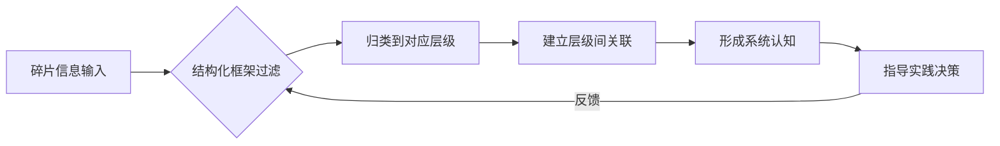
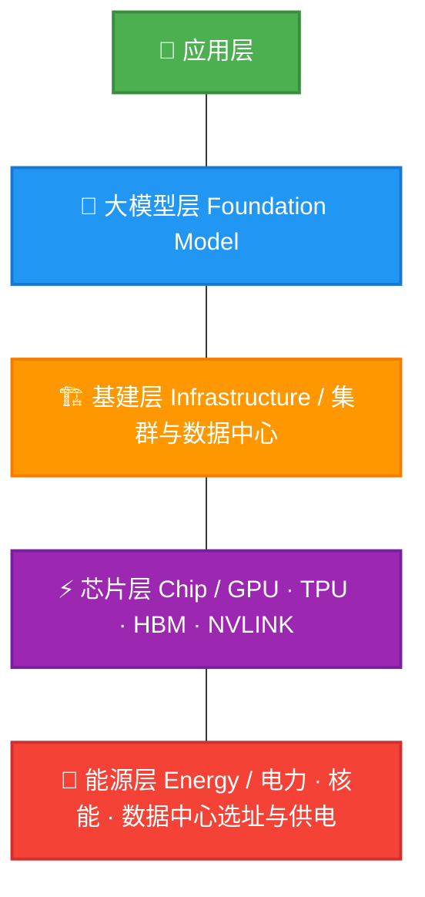
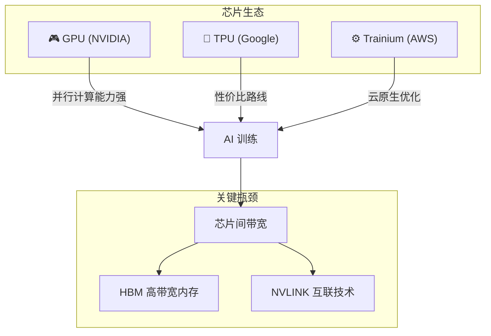
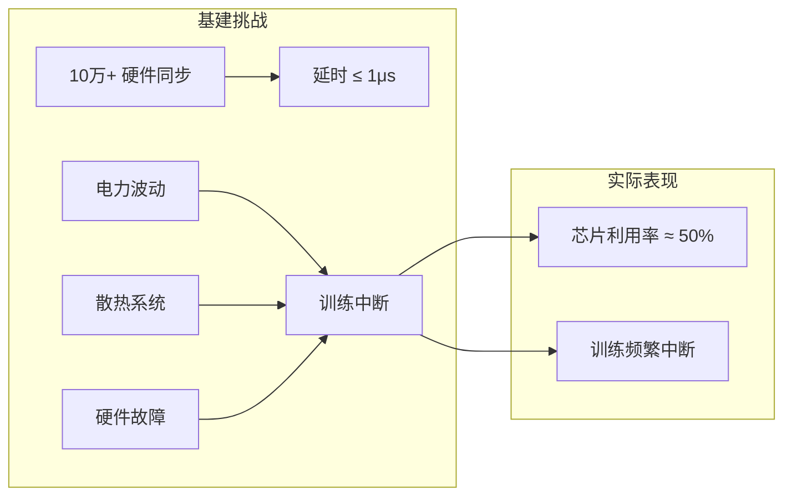
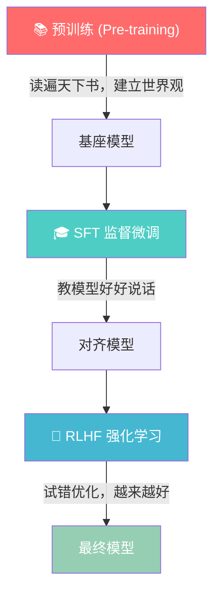
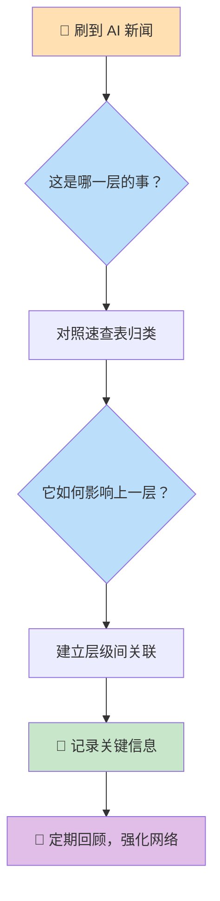
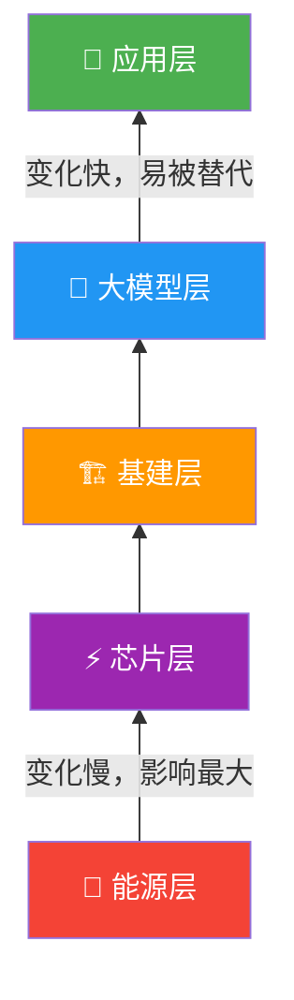

# 🧠 如何碎片化学习 AI？

> 💡 **核心观点**：现在学习 AI，碎片化可能是我们唯一的方式。不是因为没时间，而是因为 AI 在高速发展时，知识本就是碎片化产生的。

---

## 一、为什么碎片化学习反而是正确的？

今天来分享我自己碎片化学习 AI 的方法。先说一个**反直觉的观点**：

前沿突破常先出现在社交平台（Twitter/X、Reddit、微信公众号），等成书或课程时已经过时，行业早已迭代数轮。所以核心问题不是"要不要碎片化"，而是——

> **如何把碎片装进结构化框架，形成真正的认知体系。**

---

## 二、黄仁勋的 AI 五层结构

这里分享黄仁勋提出的 **AI 五层结构**，这是一个非常好的认知框架。每一层都被下一层"卡脖子"：大模型进步慢，可能是集群不稳；集群不稳，可能是芯片带宽不足；带宽受限，又源于能源效率逼近物理极限。

> ▲ 越底层影响越大、变化越慢 ｜ 越顶层变化越快、易被替代 ▲

### 🔑 核心思考方法

> 看任何 AI 新闻，都可以问自己两句话：
> 1. **这是哪一层的事？**
> 2. **它如何影响上一层？**

用一个具体问题来串一遍五层，实操感受框架的价值——比如：**"训练 GPT-5 级模型需要什么？"**

---

## 三、逐层深度解析

### 🔋 第1层：能源层 — AI 时代的终极竞争

| 指标 | 数据 |
|------|------|
| 数据中心功率需求 | ~1GW（约中型核电站功率） |
| 等效家庭用电 | 约 100 万户家庭同时用电 |
| 训练时长 | 连续运行数月 |
| 下一代数据中心投入 | ~500 亿美元 |
| 预期年收入 | 100 ~ 120 亿美元 |

**关键洞察**：下一代数据中心多以 **1GW** 起步。AI 时代的竞争，**本质是能源竞争**。谁能获得稳定、廉价、大规模的电力，谁就掌握了 AI 发展的基础。

---

### ⚡ 第2层：芯片层 — 每瓦电能换多少次矩阵乘法

核心指标是 **"每瓦电能换多少次矩阵乘法"**。

| 芯片方案 | 优势 | 适用场景 |
|----------|------|---------|
| NVIDIA GPU | 并行计算能力强，生态成熟 | AI 训练首选 |
| Google TPU | 性价比高，针对 Tensor 运算优化 | 大规模推理 |
| AWS Trainium | 云原生整合，成本优化 | 云端训练 |

**关键瓶颈**：上万张 GPU 需要高速同步数据，**HBM 高带宽内存**和**英伟达 NVLINK 互联技术**因此极度稀缺。带宽已经成为比算力更核心的制约因素。

---

### 🏗️ 第3层：基建层 — 规模化与稳定性的极限挑战

核心是**规模化与稳定性**。让十万硬件同步、延时 ≤ 1 微秒是极难的工程挑战。

| 挑战项 | 详情 |
|--------|------|
| 硬件同步 | 10万+ 设备，延时需控制在 1 微秒以内 |
| 芯片利用率 | 实际仅约 **50%**（理想 vs 现实差距巨大） |
| 中断因素 | 电力波动、散热不足、硬件故障 |
| 行业影响 | OpenAI 自 GPT-4o 后转向后训练与强化学习 |

**关键洞察**：OpenAI 自 GPT-4o 后未完整预训练大模型，转向后训练与强化学习，正是受基建瓶颈限制。**不是不想练更大的模型，而是基建跟不上。**

---

### 🤖 第4层：大模型层 — 最熟悉也最碎片化的一层

这是大家最熟悉但也**最碎片化**的一层。以下是核心概念的直觉类比：

#### 大模型训练三阶段类比

| 阶段 | 术语 | 直觉类比 | 说明 |
|------|------|---------|------|
| 第一阶段 | **预训练 (Pre-training)** | 📚 读遍天下书建世界观 | 海量数据学习语言规律和世界知识 |
| 第二阶段 | **SFT (监督微调)** | 🎓 教模型好好说话 | 用高质量问答对微调行为 |
| 第三阶段 | **RLHF (强化学习)** | 🎯 试错优化回答 | 基于人类反馈持续改进 |

#### 预训练成本对比（2025年后）

| 模型规模 | 参数量 | 单次预训练成本 |
|----------|--------|---------------|
| 小型模型 | ~70 亿 (7B) | 数十万美元 |
| 中型模型 | ~700 亿 (70B) | 数百万美元 |
| GPT-4 级 | 万亿级 | **上亿美元** |

**关键趋势**：预训练成本极高，**后训练与强化学习成为 2025 年后的热点**。顶尖研究员的价值，在于用直觉与品味决定数亿美元的投入方向——这是目前 AI 还无法替代的人类能力。

---

### 🚀 第5层：应用层 — 决定 AI 能否变现

决定模型能否成为付费产品。应用形态正在经历四个演进阶段：

#### AI 应用四大形态

| 形态 | 名称 | 特征 | 人类参与度 | 代表产品 |
|------|------|------|-----------|---------|
| ① | **Chatbot** | 问答交互 | 🟢 高（主导） | ChatGPT、文心一言 |
| ② | **Copilot** | 人机协同 | 🟡 中（协作） | GitHub Copilot、Cursor |
| ③ | **Agent** | 自主拆解执行任务 | 🟠 低（监督） | Claude Code、Devin |
| ④ | **Autonomous AI** | 完全自主运行 | 🔴 极低（看结果） | 未来形态 |

#### 2025-2026 趋势

- **2025 年成功应用**：Cursor（改良路线）、Claude Code（智能体路线）
- **2026 年趋势**：模型能力趋同，**应用与商业模式创新**将成竞争核心
- **商业模式**：甚至 OpenAI 可能引入广告模式，AI 变现路径多元化

---

## 四、碎片化学习实操指南

### 📋 新闻归类速查表

当你刷到一条 AI 新闻时，可以快速对照以下表格进行归类：

| 新闻关键词 | 所属层级 | 示例 |
|-----------|---------|------|
| 核电站、能源、电力、碳中和 | 🔋 第1层 能源 | "微软签约核电站为数据中心供电" |
| GPU、TPU、HBM、芯片制程 | ⚡ 第2层 芯片 | "英伟达发布新一代 B200 芯片" |
| 数据中心、集群、分布式训练 | 🏗️ 第3层 基建 | "Meta 建设 2GW 超级数据中心" |
| Transformer、Scaling Law、RLHF | 🤖 第4层 大模型 | "DeepSeek-V3 开源千亿参数模型" |
| 提示词、Agent、Copilot、RAG | 🚀 第5层 应用 | "Cursor 月活突破千万" |

### 🧭 每日学习工作流

---

## 五、总结

### 框架的核心价值

> 这个框架的最大价值是：刷到 AI 新闻时，能**快速归类**到对应层级——芯片讨论放第二层，提示词技巧放第五层，Scaling Law 放第四层。慢慢地，零散知识会在脑中**连成网络**。

### 关键认知

| 特征 | 底层（能源/芯片） | 顶层（大模型/应用） |
|------|------------------|-------------------|
| 变化速度 | 🐢 慢 | 🐇 快 |
| 影响范围 | 🌍 全局性、根本性 | 🎯 局部性、表面性 |
| 可替代性 | 🔒 极低 | 🔄 极高 |
| 投入周期 | 📅 年计 | ⏰ 月计/周计 |
| 关注优先级 | ⭐⭐⭐ 值得深度研究 | ⭐⭐ 保持跟踪即可 |

> 📌 **越底层的变化影响越大，但发生慢；越上层的变化发生快，易被替代。** 理解这一点，就知道该把注意力放在哪里。

---

*📅 最后更新：2026年3月*
